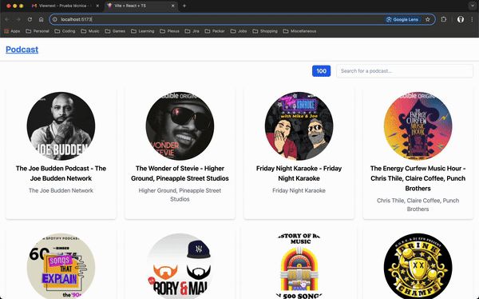

# VN Podcast Player

This project is a podcast player that fetches the podcasts from the [iTunes 100 most listened podcast](https://itunes.apple.com/us/rss/toppodcasts/limit=100/genre=1310/json). The application is built using React, Redux, and TailwindCSS.

## IMPORTANT

The application is using CORS_ANYWHERE to fetch the data from the iTunes API. The application is using the free version of CORS_ANYWHERE, so before the first launch, go to the [CORS_ANYWHERE](https://cors-anywhere.herokuapp.com/corsdemo) page and click on the button to enable the CORS proxy. After that, the application will be able to fetch the data from the iTunes API and the RSS pages.

## Available Scripts

In the project directory, you can run:

### `yarn`

Installs the dependencies of the project.

### `yarn preview:dev`

Runs an app preview with development build folder, without minimizing the assets.

### `yarn preview:prod`

Runs an app preview with production build folder, including minimized and optimized assets.

### `yarn dev`

Runs the app in the development mode.
Open [http://localhost:5173](http://localhost:5173) to view it in the browser.

### `yarn dev:prod`

Runs the app in the production mode.

### `yarn build`

Builds the app for development to the `dist` folder.

### `yarn build:prod`

Builds the app for production to the `dist` folder.

### `yarn test`

Launches the test runner in the interactive watch mode.

#### Unit tests

The unit tests are located in the `__tests__` folder in the module that is going to be tested. The unit tests are written using Vitest and React Testing Library.

#### Integration tests

The integration tests are located in the `__tests__` folder in the module that is going to be tested. The integration tests are written using Vitest and React Testing Library.

## Application Structure

The application is based on clean architecture principles combined with modular (features) design. The application is divided into the following modules:

- **Main Page (PodcastList)**: Contains the podcast list for the first 100 podcasts.
- **Podcast Detail Page (PodcastDetail)**: Contains the podcast details for a specific podcast.
- **Podcast Player (PodcastPlayer)**: Contains the podcast player for a specific podcast episode.

Each module contains the following structure:

- **Adapters**: Contains the adapters that are used to convert the data from the API to the data that is used in the application. Also containes interceptors for the API requests in case fails or needs a special header request.
- **Components**: Contains the components that are used in the page.
- **Hooks**: Contains the hooks that are used in the page.
- **Model**: Contains the model for the entity that is used for the application.
- **Pages**: Contains the page that is used for the module that is going to be included in the navigation routes.
- **Redux**: Contains the redux actions, reducers, and selectors for the module.
- **Services**: Contains the services that are used to fetch the data from the API.

The application also contains the following folders:

- **Utils**: Contains the utility functions that are used in the application as date formatters, arithmetic operations, etc.
- **Routes**: Contains the routes that are used in the application.

## Libraries

The application uses the following libraries:

- **axios**: Used to fetch the data from the API.
- **redux-toolkit**: Used to manage the state of the application.
- **react-router-dom**: Used to manage the navigation of the application.
- **tailwindcss**: Used to style the application.
- **rss-parser**: Used to parse the RSS feed from the podcast.
- **xml2js**: Used to parse the XML feed from the podcast.
- **dompurify**: Used to sanitize the HTML content from the podcast.

## License

This project is licensed under the MIT License - see the [LICENSE.md](LICENSE.md) file for details.
